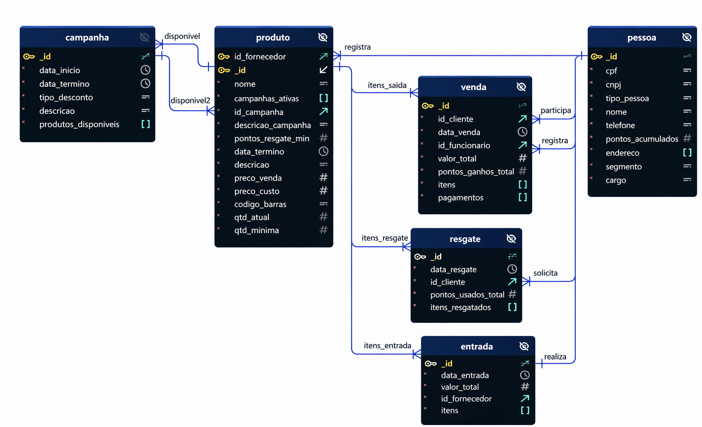

# Docker — Mercadinho São Miguel - Como subir

## Portas

| Porta (host) | Serviço         | Descrição                                    |
|--------------|------------------|---------------------------------------------|
| `3000`       | `miguel-frontend`| Frontend (React + Vite, dev server)         |
| `7001`       | `miguel-produtos`| API de produtos, entradas e campanhas       |
| `7002`       | `miguel-pessoas` | API de pessoas (clientes e funcionários)    |
| `7003`       | `miguel-vendas`  | API de vendas e resgates de pontos          |
| `7004`       | `miguel-mongodb` | MongoDB                                     |
| `7005`       | `miguel-docs`    | Documentação Swagger (Swagger UI)           |

## Contexto do Projeto
O projeto consiste em um sistema de mercado, que possui dados dos funcionários e clientes, além de dados dos produtos, vendas e estoque.

Além disso, o mercado possui um sistema de fidelização por pontos, que podem ser resgatados por produtos quando houver campanhas que possuam tais produtos.

O banco possui a seguinte estrutura:



## Estrutura de Pastas

```
sao_miguel/
├── docker-compose.yml   # Orquestração de todos os serviços
├── Dockerfile           # Imagem base usada pelas APIs
├── init-db.js           # Seed inicial do MongoDB
├── package.json         # Dependências compartilhadas das APIs
├── modelagem.png        # Diagrama do banco
│
├── produtos/            # API de produtos, entradas e campanhas
├── pessoas/             # API de pessoas (clientes e funcionários)
├── vendas/              # API de vendas
├── resgate/             # API de resgates de pontos
│   ├── server.js        # Ponto de entrada do serviço
│   ├── config/          # Conexão com o banco (dbConnect.js)
│   ├── models/          # Schemas do Mongoose
│   ├── routes/          # Definição das rotas
│   ├── controllers/     # Tratamento das requisições
│   └── services/        # Regras de negócio
│
├── docs/                # Swagger UI (openapi.js + server.js)
│
└── frontend/            # React + Vite
    ├── index.html
    ├── vite.config.js
    └── src/
        ├── main.jsx, App.jsx
        ├── routes/      # Páginas (Pdv, Products, Entries, Pessoas, Resgates)
        ├── components/  # Componentes reutilizáveis (um por pasta)
        ├── services/    # Cliente HTTP das APIs (api.js)
        └── utils/       # Funções auxiliares (format.js)
```

As APIs `produtos`, `pessoas`, `vendas` e `resgate` seguem a mesma estrutura interna (`server.js`, `config/`, `models/`, `routes/`, `controllers/`, `services/`).

## Criar a rede e subir os containers (deve estar no diretorio raiz do projeto)

```bash
docker network create rede-mercadinho
docker compose up -d
```

Adicione `--build` se tiver alterado o `Dockerfile` ou o `package.json` da raiz:

```bash
docker compose up -d --build
```

## Descer os containers

```bash
docker compose down
```

Isso para e remove os containers e a rede, mas **mantém** o volume `dados_mongodb` (os dados do MongoDB continuam salvos).

Para descer **e apagar também os dados do banco**, use `-v` (remove os volumes nomeados, incluindo `dados_mongodb`):

```bash
docker compose down -v
```

## MongoDB

O MongoDB roda no serviço `miguel-mongodb` e é o único que guarda estado (o volume nomeado `dados_mongodb`).

Subir só o Mongo (por exemplo, para inspecionar os dados sem levantar as APIs):

```bash
docker compose up -d miguel-mongodb
```

Descer só o Mongo, mantendo o volume (os dados continuam salvos para a próxima subida):

```bash
docker compose stop miguel-mongodb
```

Remover o container do Mongo mas manter os dados (o `-v` aqui é do próprio `rm`, não do compose, e só afeta volumes anônimos — o volume nomeado `dados_mongodb` não é tocado):

```bash
docker compose rm -f -s miguel-mongodb
```

Apagar o container **e os dados** (equivalente a resetar o banco do zero):

```bash
docker compose down -v
```

### Seed inicial (`init-db.js`)

O arquivo `init-db.js` é montado em `/docker-entrypoint-initdb.d/init-db.js` dentro do container do Mongo. A imagem oficial do MongoDB executa qualquer script nessa pasta automaticamente, mas **só na primeira vez que o volume de dados é criado** — se o volume `dados_mongodb` já existe, o script é ignorado.

Ele popula as coleções `produtos`, `campanhas`, `entradas`, `pessoas`, `vendas` e `resgates` com dados de exemplo e cria os índices únicos (`codigo_barras` em produtos, `cpf` em pessoas).

Para forçar o seed rodar de novo (por exemplo, depois de editar `init-db.js`), é preciso apagar o volume primeiro, já que ele só roda em volume novo:

```bash
docker compose down -v
docker compose up -d --build
```
